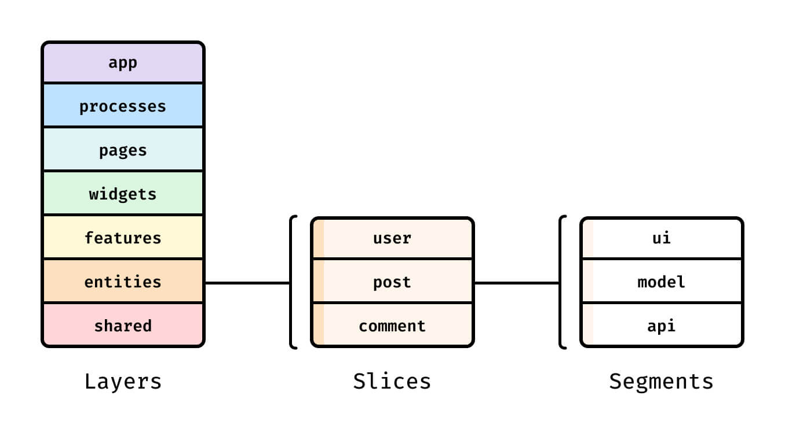

# Nextplate

Ultimate template for Next.js with a pack of incredible tools


## Introduction
This is a **template** with all you need for your next web application. Aims for developers who really care about code quality, architecture, security and all the best practices in frontend.

---

## Features

#### Architecture (WIP!)
- **[Feature-Sliced Design](https://feature-sliced.design)** – An architectural methodology for scaffolding front-end applications. The main purpose of this methodology is to make the project more understandable and structured in the face of ever-changing business requirements.

#### Framework

- **[Next](https://nextjs.org)** – A complete React framework for hybrid and server rendering

#### Localization

- **[next-i18next](https://github.com/i18next/next-i18next)** – The easiest way to translate your NextJs apps

#### State Management

- **[effector](https://effector.dev)** – A lightweight and performant state manager that is UI frameworks agnostic, predictable and easy to use

#### Data Fetching

- **[farfetched](https://farfetched.pages.dev)** – The advanced data fetching tool for web applications
- **[axios](https://axios-http.com)** – Promise based HTTP client for the browser and Node.js
- **[orval](https://orval.dev)** – Generate, valid, cache and mock in your frontend applications all with your OpenAPI specification.
- **[msw](https://mswjs.io)** – Mock by intercepting requests on the network level. Seamlessly reuse the same mock definition for testing, development, and debugging.

#### Design System & Styling

- **[Storybook](https://storybook.js.org)** – A frontend workshop for building UI components and pages in isolation.
- **[Radix](https://www.radix-ui.com)** – An open-source UI component library for building high-quality, accessible design systems and web apps.
- **[emotion](https://emotion.sh/docs/introduction)** – a library designed for writing css styles with JavaScript
- **[framer-motion](https://www.framer.com/motion/)** – A production-ready motion library for React

#### Validation

- **[Zod](https://zod.dev)** – TypeScript-first schema declaration and validation library

#### Tests

- **[Jest](https://jestjs.io)** – A delightful JavaScript Testing Framework with a focus on simplicity
- **[Testing Library](https://testing-library.com)** –  Simple and complete testing utilities that encourage good testing practices

#### Design Patters

- **[ESLint](https://eslint.org)** – Find and fix problems in your JavaScript code
- **[Prettier](https://prettier.io)** – An opinionated code formatter, supporting multiple languages and code editors
- **[Husky](https://github.com/typicode/husky)** – Modern native Git hooks made easy
- **[lint-staged](https://github.com/okonet/lint-staged)** – Run linters against staged git files and don't let 💩 slip into your code base
- **[commitlint](https://commitlint.js.org/#/)** – Helps your team adhering to a commit convention
- **[Standard Version](https://github.com/conventional-changelog/standard-version)** – A utility for versioning using semver and CHANGELOG generation powered by Conventional Commits

#### Monitoring

- **[Sentry](https://sentry.io/)** - A crash reporting platform that provides you with "real-time insight into production deployments with info to reproduce and fix crashes"


#### Analysis

- **[why-did-you-render](https://github.com/welldone-software/why-did-you-render)** – Notify you about potentially avoidable re-renders
- **[@next/bundle-analyzer](https://www.npmjs.com/package/@next/bundle-analyzer)** - Visualize size of webpack output files with an interactive zoomable treemap.


#### Additional Plugins

- **[next-sitemap](https://github.com/iamvishnusankar/next-sitemap)** – Sitemap generator for Next.js
- **[pathpida](https://github.com/aspida/pathpida)** – TypeScript friendly internal link client for Next.js and Nuxt.js.
---

## Getting Started

1. Click on "**Use this template**" button
2. Configure your new repository and click on "**Create repository from template**" button
3. Now you can clone the generated repository to your local machine:
    ```bash
    git clone https://github.com/<YOUR-GITHUB-LOGIN>/<NAME-OF-YOUR-GENERATED-REPOSITORY>.git
    ```

4. install dependencies:
   ```bash
   yarn install
   ```

### Development

Run the local development server:

```
yarn start:dev
```

### Production

You can generate a build to test and/or deploy to your production environment.

```bash
yarn build
```

And then run the build:

```bash
yarn start:prod
```

### Running the tests

You can run tests with this commands:

```bash
yarn test
```

Run in watch mode:

```bash
yarn test:watch
```

Run to see the coverage:

```bash
yarn test:coverage
```

### Linting

You can run linting with this commands:

```bash
yarn lint
```

Run to automatically fix problems:

```bash
yarn lint:fix
```

Run to check type errors:

```bash
yarn typecheck
```

### Running storybook

You can run storybook with this commands:

```bash
yarn sb # alias to yarn storybook
```

### Misc

Run to analyse production bundle:

```bash
yarn analyse:bundle
```

Run to check for circular dependencies:

```bash
yarn analyse:circular
```

Run to check for unused dependencies:

```bash
yarn analyse:deps
```

## Project structure

### Why not just components, hooks, styles, constants, etc.?

Code organized by kind is one of the most popular ways for JavaScript developers to build their applications, structuring files based on what they are, without considering the different relationships between the files. It's a popular practice among developers who use patterns such as MVC. That’s okay when you work on small applications, but as the application grows, it can have a significant impact on the team's velocity.

When you work on a large project, it can be difficult to identify the origin of an issue. As a developer, you might spend a significant amount of time digging through thousands of lines of code until you understand all the relationships. In FSD, a project consists of layers (features, entities, shared, etc), each layer is made up of slices (aka modules) and each slice is made up of segments (model, ui, api, etc.). Slices cannot use other slices on the same layer, and that helps with high cohesion and low coupling. It helps maximize code sharing and reusability in different sections of your application and even in other projects.



See [Feature-Sliced Design overview](https://feature-sliced.design/docs/get-started/overview) to understand how project is structured and organized.

## License
Although you don't have to, if you reuse this template for your projects I would appreciate it if you would credit me and provide a link to my GitHub profile in the footer of your project. Thanks!

This project is licensed under the MIT License - see the [LICENSE.md](LICENSE.md) file for details
